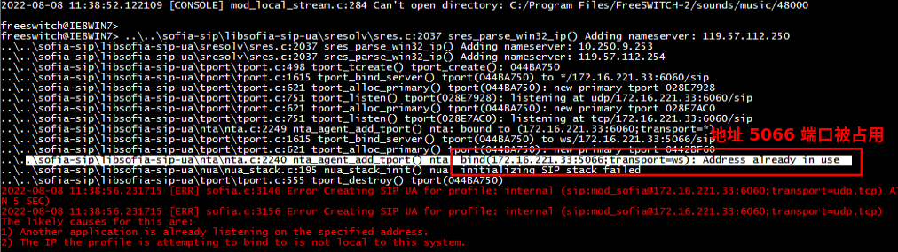

# FreeSWITCH 与 FreeSWITCH 的对接

先前讲到的 FreeSWITCH 都是单机玩的，如果想让各个 FreeSWITCH 间的用户互相呼叫，就需要对接 FreeSWITCH。

对接的关键是让呼叫 **准确路由**。

## 同一台机器上开两个 FS 实例

1. 拷贝整体文件夹（其实拷贝部分就可以了，如 配置目录、日志目录、db 目录，一些东西是可以共享使用的）
2. 修改工作端口号，防止冲突
    - Event Socket 端口号： `conf\autoload_configs\event_socket.conf.xml` `listen-port` 改为 `9021`
    - `conf\vars.xml` 中 `internal_sip_port` 改为 `6060`，`external_sip_port` 改为 `6080`
    - 如用在生产环境中需改 `switch.conf.xml` 中更改 `rtp-start/end-port`（这是指定 rtp 端口号范围的地方）
3. 启动，当有错误时设置 `conf\autoload_configs\sofia.conf.xml` 配置 `<param name="log-level" value="7"/>` 开启 debug 日志查看并解决：

    

> level 范围是 0～7，数值越大，级别越低（7 对应 debug）。
> 参考 [Troubleshooting+Debugging](https://freeswitch.org/confluence/display/FREESWITCH/Troubleshooting+Debugging)。


> 此为在 windows 上 FreeSWITCH Version 1.6.15~32bit 尝试的说明。
>
> 在《FreeSWITCH 权威指南》中讲述的是 Unix 系统的，执行方式上用的是 `/path_to_fs_2/bin/freeswitch -conf conf -log log -db db` 和 `fs_cli -P 9021` 。
>
> 注意这里面的差别可能有影响。

## 纯 Dialplan 转接

我们从场景来分析这个过程，并变更相关配置。

假设现有 A、B 两个 FreeSWITCH，a 和 b 分别为 A、B 下的注册的用户，需要解决以下两个问题。

1. a 如何从 A 呼出到达 B： 需要一个呼出的拨号计划

因为两个 FreeSWITCH 下可能都有相同的号码（如 1000），所以我们需要一个拨号方案能使部分对外的呼叫转出去，一般企业的 PBX 用 0 做 **出局字冠**，即拨号 `01000` 时，呼叫到另一个 FS 的 1000 号码上。

当呼出时，user 身上的 context 有高优先级，默认配置的是 `default` 的 context。

即在 A 机 `default` dialplan 上加如下配置：

```xml
<extension name="B">
    <condition field="destination_number" expression="^0(.*)$">
        <action application="bridge" data="sofia/external/sip:$1@${B_ip}:${B_port}"/>
    </condition>
</extension>
```

即，当输入附加 0 前缀的手机号时，会剔除首个 0，将电话从本机 external profile 向 B（B_IP 和 B_port）发送 INVITE 呼叫。

2. B 如何接收到来自 A 的呼叫：一个呼入的拨号计划

B 会在 B_port 中收到来自 A 的呼叫，因为来自外部，所以是从 sofia `external` 的 profile 进来的，这里配置的 context 是 `public`，所以会转到 `public` 的 Dialplan，因此在 public 的拨号计划中应该有如下配置：

```xml
<extension name="public_extensions">
    <condition field="destination_number" expression="^(10[01][0-9])$">
        <action application="bridge" data="$1 XML default"/>
    </condition>
</extension>
```

如上配置，尝试呼叫。

## Sofia Gateway

> 本节可参考官方文档 [Soifa-Sip-Stack](https://freeswitch.org/confluence/display/FREESWITCH/Sofia+SIP+Stack) 一节。

### 原理

FS 可以设置一个“门”（Gateway），通过这个“门”，内部的电话可以直接达到外部的某个服务器，进而呼叫对端号码。

### 相关命令

- Reload/Add profile/gateways

```
sofia profile <profile_name> [<rescan>|<restart>] reloadxml
```

- List gateways by status

```sh
sofia profile <profile> gwlist [up]|down # 需要开启心跳检测（ping 配置），成功 up，失败 down
```

- Delete gateways

```sh
sofia profile <profile_name> killgw <gw_name>|_all_
```

### Gateway 配置

首先 在 `conf/sip_profiles/*.xml` 中用 `<gateways>` 标签引入了 gateway，我们可以在引入的文件中加入 gateway 配置，关键字段如下：

```xml
<gateway name="gw1">
    <!-- 此 FS 作为客户端向 realm 注册自己。本机 5080 -> 目标机 6080 开启 OPTIONS 探测 -->
    <param name="realm" value="172.16.221.33:6080"/>
    <param name="username" value=""/>
    <param name="password" value=""/>
    <param name="ping" value="25"/>
    <param name="register" value="false"/>
</gateway>
```

- realm: 是 dialstring 中 @ 后面的表示，表示服务器地址
- username/password: 可以不用填（外来的可以不注册）
- register: 是否开启注册请求（一般不开启）
- ping: 心跳检测周期（options 请求）

然后需要配置 dialplan 需要将某种规则的拨号从 gateway 转出去：

```xml
<extension name="out through gw1">
    <condition expression="^9(10[01][0-9])$" field="destination_number">
        <action application="log" data="INFO bridge through gw1"/>
        <action application="transfer" data="sofia/gateway/gw1/$1"/>
    </condition>
</extension>
```

如上，这里设置了前缀输入 8 紧接 对方号码 时，转到 `sofia/gateway/gw1/$1`

尝试呼叫，另一端用户可以正常接通。
