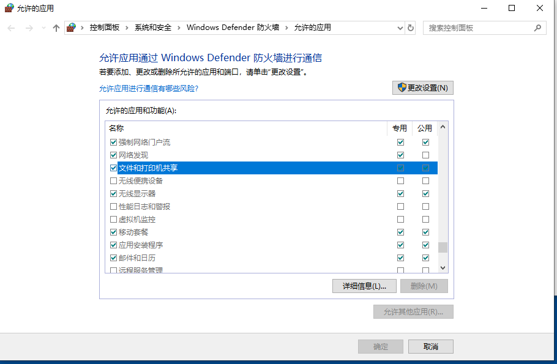

# 6.0 搭建 FS 遇到的问题

## 网络问题-通过 iptables 设置解决

背景：我使用的 virtualBox 启动 windows 安装的 FreeSWITCH 并设置虚拟机的网络是 **桥接（Bridged Adapter）** 方式玩起来的。在 linux 的宿主及虚拟机中的软电话是可以注册并呼叫使用的，但连到同样局域网的手机中的软电话却不可以注册成功。

通过测试，发现用同样局域网的另一个机器（同事的机器）ping 不通我虚拟机的 IP 地址（能 ping 通宿主机），虚拟机和宿主机上都搜不到包（ICMP 包）。因此我想到了 iptables。

> 插入一下：如果使用了桥接模式，但宿主机都无法 ping 通虚拟机 IP，则查看是不是被虚拟机网络防火墙屏蔽了，此时虚拟机上抓包的现象是 *收到了 ping 但不会返回 response，主机 ping 操作会卡住直到显示超时* （ip 找不到会直接返回 `Destination Host Unreachable` 卡住是找到但被墙了）
> window 下解决 ping 不通的问题是设置防火墙的“文件和打印机共享”应用。
> 

---

### iptables 基础

参考： https://wiki.archlinux.org/title/Iptables_(%E7%AE%80%E4%BD%93%E4%B8%AD%E6%96%87) （注意文章中的参考链接）

iptables 有 5 个 **表（Tables）**，每个表中有多个 **链（Chains）**

- Tables： 不需要知道太多，默认用的是 filter 表，命令中用 `-t` 指定对应表。
- Chains： 链是一些按 **顺序** 排列的规则列表。用 `-P` 指定 Chain。如 nat 有 `PREROUTING`, `POSTROUTING`, `OUTPUT` 链。
- Rules： 规则，过滤数据包。规则由 **多个匹配** 和 **一个目标** 指定。
- 匹配： 规则的典型匹配有 *数据包进入的端口（eth0 或 eth1）*、*数据包的类型（ICMP、TCP、UDP）*（`-p tcp`）、*数据包的目的端口*。
- 目标： 命令中用 `-j` 或 `--jump` 指定。如 `ACCEPT`、`DROP`、`QUEUE`、`RETURN` 为内置目标，`REJECT`、`LOG` 为扩展目标。

### 尝试解决

我首先进行了如下设置：

```sh
sudo iptables -L -n # 查看 iptables 表
sudo iptables -P FORWARD ACCEPT # 设置链的 FORWARD 的目标 ACCEPT
```

设置之后用虚拟机 ping 一下同事的 IP，同事立即就可以 ping 通我虚拟机的 IP 了，但由同事先发起 ping 是不通的。此时，我先用虚拟机 ping 我的手机 ip，通了后用手机软电话注册，发现注册成功。

进而我依次执行了以下操作：

```sh
sudo iptables -I INPUT -p udp -s 172.16.221.49 -j ACCEPT # INPUT 链中加入规则，放行 源IP xxx.49
# 此时尝试手机呼叫 echo，不通
sudo iptables -I FORWARD -p udp -s 172.16.221.49 -j ACCEPT # FORWARD 链中加入规则
# 此时尝试手机呼叫 echo，通了
sudo iptables -L -n --line-number # 列出规则，并用 number 标号每个规则条目准备删除
sudo iptables -D INPUT 1 # 删除了 INPUT 中第一条规则
# 此时尝试手机呼叫 echo，依然通
# 因此判断到，将 FORWARD 链中配置放行我的手机 IP 就可以用手机呼叫 FreeSWITCH 了
```

## profile 启动不起来

profile 可用此命令启动：

```sh
sofia profile external start
```

可用此命令查看状态

```
sofia status profile external
```

如果遇到如下错误，不要慌张，这是因为 db 文件损坏了，删除对应的 db 文件重启可解决。（db 文件默认在安装目录的 db 目录下）。
如当下错误需要移除 sofia_reg_external.db 文件。

```log
[ERR] switch_core_db.c:108 SQL ERR [unsupported file format]
[ERR] switch_core_db.c:223 SQL ERR [unsupported file format]
[CRIT] switch_core_sqldb.c:508 Failure to connect to CORE_DB sofia_reg_external!
```

## PJSIP UDP SIP 包超过 MTU 而转换为 TCP 传输

> PJSIP 是一个开源的多媒体通讯库，它基于一些标准协议实现的，结合了 SIP 和 NAT 功能，并提供了可移植的高层 API 几乎适用于任何系统。

PJSIP 底层会自动检测 UDP 消息当过大时自动切换为 TCP 传输（开启 TCP 状态下）。参考：
[PJSIP：Using_SIP_TCP](https://trac.pjsip.org/repos/wiki/Using_SIP_TCP#switch)

自动切换 TCP 在 [rfc3261-18.1.1](https://www.rfc-editor.org/rfc/rfc3261#section-18.1.1) （RFC SIP 协议-通讯章节）有介绍：

> ```
>"If a request is within 200 bytes of the path MTU, or if it is larger than 1300 bytes and the path MTU is unknown, the request MUST be sent using an RFC 2914 congestion controlled transport protocol, such as TCP."
> ```

大意是：如果一个请求和 [path MTU](https://baike.baidu.com/item/PMTU/1963207) 差值在 200B 内或未知 path MTU 的值而请求大于 1300B 时，请求必须使用一个带拥塞控制的协议进行传输，如 TCP。（[RFC 2914](https://rfc2cn.com/rfc2914.html) 是拥塞控制协议的原则）。

> 我的本来问题是在 WSL 中开发 PJSIP 时发现超过 MTU 的 SIP 消息一直重发，最后定位到是 WSL 的 bug。
>
> 由于 pjsip 可以自动转换为 TCP 发送包，所以我可以开启 TCP 规避这个问题。
>
> 网上查 UDP 包最大可支持 65507 的大小的，即便被 IP 分包，但重组后校验没问题也不应该丢弃（因为分包会导致丢包概率变大）。
>
> 使用了 traceroute 工具：`traceroute -p 5474 39.106.32.143 1401` 此命令表示向目标机器 39.106.32.143 的 5474 端口发送大小为 1401 的 UDP（默认）包。
>
> 必须提醒自己：Be Smart!!! 这里花费了我好长时间，问题调查流程要优化：
> - 1. 对比问题差异点；
> - 2. 透过现象快速精准确定调查方向；
> - 3. 熟练使用工具验证（nc、traceroute 等）
> - 4. 搜索引擎技巧
>
> [WSL issue: Can't send or receive fragmented UDP packets](https://github.com/microsoft/WSL/issues/6082)

---

备看的文章：http://feel.name/?p=233，可能对网络的了解向更底层进一步。如果在自己的设备上丢包，RX dropped 的数值应该会非 0。
