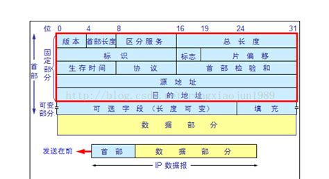
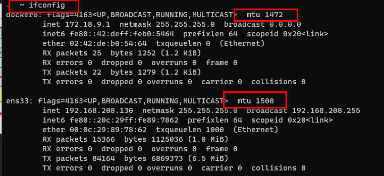
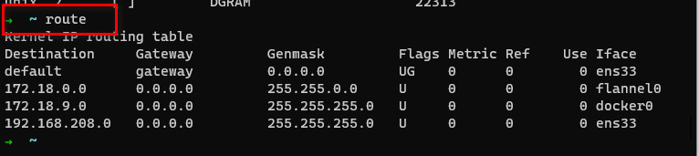

# IP 协议详解

要点：
1. IP 头大小（20~60B）
2. IP 分片（MTU）
3. IP 路由过程（route 命令，路由的选择）
4. IP 转发过程（TTL）

---

## IP 头部

IP 协议头一般为 20 字节，另外有 40 字节的可选部分，所以最长 60 字节。

4bit 版本号：值为 4；
4bit 头长度；
8bit 服务类型（TOS）：3bit 优先权 + 4bit TOS + 1bit 保留；TOS：最小延时、最大吞吐量、最高可靠性、最小费用。（ssh / telnet 这种登录程序需要的是最小延时，ftp 是最大吞吐量的服务）；
16bit IP 报最长度，即最大 65535；

16bit ID 字段，唯一标识一个数据包，被分片的数据包具有相同值；
3bit Flag 字段，1bit 保留 + 1bit 禁止分片（DF，Don't Fragment）+ 1bit 更多分片（MF，More Fragment）。如果 DF=1，且 IP 报文大于 MTU，报文将被 IP 模块丢弃，并返回 ICMP 差错报文。MF=1 表明后面还有相同 ID 的 IP 包。
13bit offset 分片偏移量，`实际偏移值 = 值 << 3 = 值 * 8`

8bit TTL，最大经过的路由跳数；
8bit Protocol，用于区分上层协议（参考 `/etc/protocals` 定义的值）

## IP 分片

以太网帧的 MTU 为 1500 字节，超过此大小的数据需要分片传输。

MTU 可通过 ifconfig 查看：

由于 IP 头至少占用 20 字节，所以以太网 IP 数据报最多携带数据为 1480 字节。

## IP 路由

IP 路由过程：IP 数据包应该发送到那个下一跳的路由（或目标机），以及经过那个网卡来发送。

使用 route 命令查看路由表

路由机制（数据报走向的匹配顺序）：
- 查找完全匹配的主机 IP 地址
- 查找匹配的网络地址的 IP 地址
- 使用默认路由项，这通常意味着数据报的下一跳路由是网关。

## IP 转发

不是发送给本机的 IP 数据报将由数据报转发子模块处理。路由器都能执行转发操作，但主机一般只发送和接收数据报，这是因为主机配置 `/proc/sys/net/ipv4/ip_forward` 默认设为 0 的缘故。

转发过程：
- 检查数据报头 TTL 值，若为 0 丢弃
- 查看报头严格源路由选择选项，若已被设置，验证目标 IP 是否为本机 IP，若不是发送一个 ICMP 失败报文给发送端
- 若由必要，给源端发送 ICMP 重定向报文，告诉合理的下一跳
- TTL - 1
- 处理 IP 头部选项
- 若有必要进行 IP 分片

---

重定向、IPv6 略
