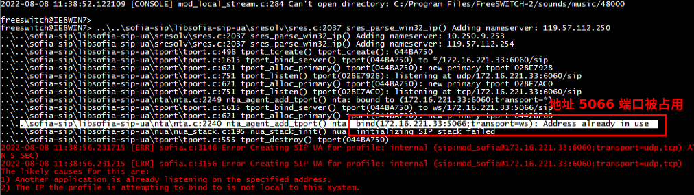

# FreeSWITCH 与 FreeSWITCH 的对接

先前讲到的 FreeSWITCH 都是单机玩的，如果想让各个 FreeSWITCH 间的用户互相呼叫，就需要对接 FreeSWITCH。

## 同一台机器上开两个 FS 实例

1. 拷贝整体文件夹（其实拷贝部分就可以了，如 配置目录、日志目录、db 目录，一些东西是可以共享使用的）
2. 修改工作端口号，防止冲突
    - Event Socket 端口号： `conf\autoload_configs\event_socket.conf.xml` `listen-port` 改为 `9021`
    - `conf\vars.xml` 中 `internal_sip_port` 改为 `6060`，`external_sip_port` 改为 `6080`
    - 如用在生产环境中需改 `switch.conf.xml` 中更改 `rtp-start/end-port`（这是指定 rtp 端口号范围的地方）
3. 启动，当有错误时设置 `conf\autoload_configs\sofia.conf.xml` 配置 `<param name="log-level" value="7"/>` 开启 debug 日志查看并解决：

    

> level 范围是 0～7，数值越大，级别越低（7 对应 debug）。
> 参考 [Troubleshooting+Debugging](https://freeswitch.org/confluence/display/FREESWITCH/Troubleshooting+Debugging)。
