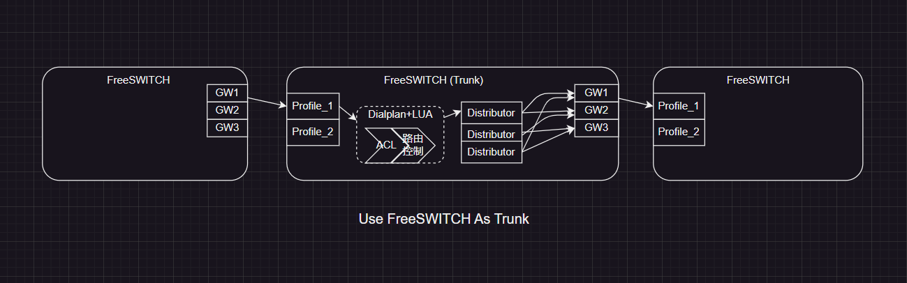

# Sofia Gateway

> 本节可参考官方文档 [Soifa-Sip-Stack](https://freeswitch.org/confluence/display/FREESWITCH/Sofia+SIP+Stack) 一节。

## 原理

FS 可以设置一个“门”（Gateway），通过这个“门”，内部的电话可以直接打到外部的某个服务器，进而呼叫对端号码。

## 相关命令

```sh
# Reload/Add profile/gateways
sofia profile <profile_name> [<rescan>|<restart>] [gw_name]

# List gateways by status
sofia profile <profile> gwlist [up|down]

# Delete gateways
sofia profile <profile_name> killgw <gw_name>|_all_
```

## Gateway 配置

首先 在 `conf/sip_profiles/*.xml` 中用 `<gateways>` 标签引入了 gateway，我们可以在引入的文件中加入 gateway 配置，关键字段如下：

```xml
<gateway name="gw1">
    <!-- 此 FS 作为客户端向 realm 注册自己。本机 5080 -> 目标机 6080 开启 OPTIONS 探测 -->
    <param name="realm" value="172.16.221.33:6080"/>
    <param name="username" value=""/>
    <param name="password" value=""/>
    <param name="ping" value="25"/>
    <param name="register" value="false"/>
</gateway>
```

- realm: 是 dialstring 中 @ 后面的表示，表示服务器地址
- username/password: 可以不用填（外来的可以不注册）
- register: 是否开启注册请求（一般不开启）
- ping: 心跳检测周期（options 请求）

然后需要配置 dialplan 需要将某种规则的拨号从 gateway 转出去：

```xml
<extension name="out through gw1">
    <condition expression="^9(10[01][0-9])$" field="destination_number">
        <action application="log" data="INFO bridge through gw1"/>
        <action application="transfer" data="sofia/gateway/gw1/$1"/>
    </condition>
</extension>
```

如上，这里设置了前缀输入 8 紧接 对方号码 时，转到 `sofia/gateway/gw1/$1`

尝试呼叫，另一端用户可以正常接通。

## 负载到多个 GW

可以使用 distributor 模块。

- 在 `modules.conf.xml` 中启用： `<load module="mod_distributor"/>`。
- 在 `conf/autoload_configs/distributor.conf.xml` 中配置网关组。

```xml
<configuration name="distributor.conf" description="Distributor Configuration">
   <lists>
     <list name="gw_group_1">      <!-- 一个组，按 1:2 负载 -->
       <node name="gw1" weight="1"/>
       <node name="gw1" weight="2"/>
     </list>
   </lists>
</configuration>
```

- 在 dialplan 中外呼时使用：

```xml
<condition field="destination_number" expression="(^\d+$)">
    <action application="bridge" data="sofia/gateway/${expand(distributor gw_group_1 ${sofia(profile external gwlist down)})}/$1"/>
</condition>
```

- `fs_cli -x 'distributor_ctl reload'`
- distributor 使用中是排除某些指定 Gateway，所以用 `sofia(profile external gwlist down)`

## 用 FreeSWITCH 做中继

这里用 FreeSWITCH 对接两个 FreeSWITCH 来讲解原理

1. FreeSWITCH 使用 Profile 接收来自外界的呼叫
2. 收到之后会经过 Dialplan，Dialplan 中对来源 IP 进行验证（ACL），然后控制路由 Bridge 到某一个 Dispatcher
3. Distributor 是 Gateway 组，会根据组内的 Gateway 权重进行分发
4. Gateway 是 FreeSWITCH 的呼叫出口


