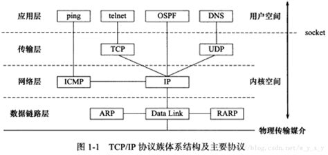
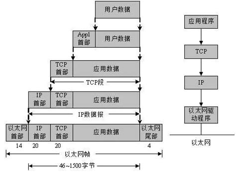
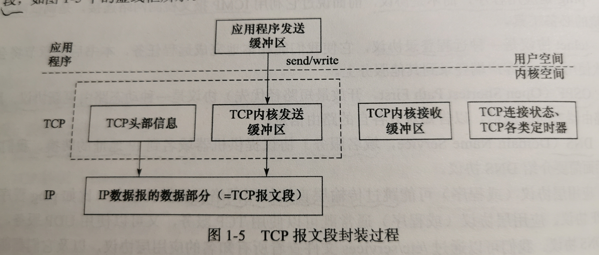

# TCP/IP 协议族

要点：
1. 四层模型中各层的作用以及协议
2. 协议的封装与分用（关键名词：帧、MTU）
3. ARP 的工作原理（广播+单回）
4. DNS 的工作原理（文件位置）
5. socket 的理解

---

## 四层协议简介



**数据链路层**

数据链路层使用物理地址 MAC 寻址一台机器。
实现网卡接口的网络驱动程序，以处理数据在物理媒介上传输。

ARP 协议，Address Resolve Protocol，地址解析协议，根据地址查 MAC。
RARP 协议，Reverse Address Resolve Protocol，逆地址解析协议，根据 MAC 查地址（用于无盘工作站，因为无法存储自己的 IP 地址所以向网络管理者询问）。

**网络层**

数据包选路与转发，选择中间节点，确定两台主机间的通信路径。

IP 协议，Internet Protocol，因特网协议，寻找下一跳（next hop）的路由器并转发数据包。
ICMP 协议，Internet Control Message Protocol，因特网控制报文协议，用于检测网络连接。（8 位类型 + 8 位代码 + 16 位校验和）。

**传输层**

提供端到端的通信，只关心通信的起始端和目的端。

TCP 协议，Transmission Control Protocol，传输控制协议，为应用层提供可靠的、面向连接的、基于流的服务，使用超时重传、数据确认等方式保证可靠。
UDP 协议，User Datagram Protocol，用户数据报协议，为应用层提供不可靠的、无连接的、基于数据报的服务。
SCTP 协议，Stream Control Transmission Protocol，流控制传输协议，为在因特网上传输电话信号而设计的协议。

**应用层**

负责处理应用程序的逻辑，**在用户空间实现（上文三个协议都是在内核空间中实现）**。
DNS 协议，Domain Name Service Protocol，域名服务协议，提供域名到 IP 地址的转换。
OSPF，Open Shortest Path First Protocol，开放最短路径优先协议，是一种动态路由更新协议，用于路由器之间的通信，以告知对方各自的路由信息。
telnet 协议是一种远程登陆协议。
ping 是个应用程序，不是协议，利用 ICMP 检测网络连接（典型的跳过传输层，直接使用网络层提供的服务）

> linux 通过 `/etc/services` 文件查看所有知名应用层协议。


## 协议的封装与分用



上层协议使用下层协议提供的服务是通过下层协议的 **封装** 实现的，自上向下每层协议都将上层数据封装，加上自己的头部信息（有时还包含尾部信息），以实现本层的功能。

如下图，TCP 模块将发送缓冲区中的数据封装上 TCP 头部信息作为 IP 数据报的数据部分。



当帧达到目标主机后，将沿着协议栈自底向上依次传递，各层协议解析出来本层信息，这个过程叫 **分用**。

数据链路层封装后的数据称为 **帧**（frame），传输媒介不用，帧的类型也不同，如以太网上传输的是以太网帧（ethernet frame），令牌环网络上传输的是令牌环帧（token ring frame）。

**帧是最终在物理网络上传输的字节序列**。至此，封装完成。

**MTU** （Max Transmit Unit，最大传输单元）为帧最多能携带多少上层的数据（帧的数据部分），以太网帧的 MTU 是 1500 字节（最大 IP 包是 1500 字节）。大于此数据量的 IP 数据报需要分片传输。


## ARP 协议工作原理

**任意网络地址到任意物理地址的转换**，IP 地址到以太网地址（MAC 地址）的转换只是其中一种，下面只讨论这种。

原理：主机向自己所在网络中 **广播一个 ARP 请求**，该请求包含目标机器的网络地址。**只有被请求的目标机器** 回应此 ARP 应答，包含自己的物理地址。

ARP 维护了一个高速缓存，存储了经常访问或最近访问的机器 IP 地址到物理地址的映射。linux 上通过 `arp` 命令查看和修改 ARP 高速缓存。

### ARP 欺骗

利用特性：ARP 协议中，请求主机在收到 ARP 应答包后，不会验证自己是否真正请求过就保存下 ARP 映射关系。
因此，只要攻击方只发送错误的应答包，就是先了 ARP 欺骗。

ASR 欺骗的影响：无法上网、嗅探所有数据包、篡改数据包、控制主机。
防御：MAC 绑定、静态 ARP 缓存表、使用 ARP 服务器、其他防护类软件。

## DNS 工作原理

DNS 是一套分布式域名服务系统。每个 DNS 服务器上存放着大量机器名和 IP 地址的映射。
Linux 使用 `/etc/resolv.conf` 文件存放 DNS 服务器的 IP 地址。
Linux 自带的 `host` 命令用于查询 DNS 服务器。

> ```sh
> # -t A 表示使用 A 类型查询
> $ host -t A www.baidu.com
> www.baidu.com is an alias for www.a.shifen.com.
> www.a.shifen.com has address 110.242.68.3
> www.a.shifen.com has address 110.242.68.4

## socket 和 TCP/IP 协议族关系

socket 是一套通用网络编程接口，是访问 **内核数据** 和 **控制底层通信** 的接口。（理解就是对内核封装信息的暴露的接口，以便上层使用和控制）

作用：
一是负责在用户缓冲区和 TCP/UDP 内核缓冲区间拷贝，用于发送/读取数据；
而是提供了控制各层协议的头部信息或其他数据结构，以便精细控制底层通信。
