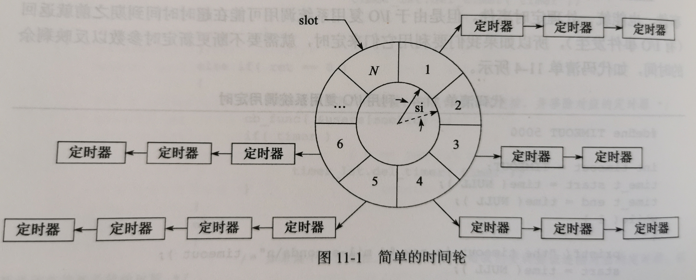

# 定时器

网络程序中需要处理的第三类事件是定时事件，服务器程序通常管理者众多定时事件，如何有效地组织这些定时事件，使之既能在预期时间点被触发又不影响服务器侏罗纪及性能至关重要。

两种高效的管理定时器的容器：事件轮和时间堆。

> 还有其他容器，如排序链表、红黑树。Nginx 中用的定时器就是用红黑树。（参考 《深入理解 Nginx》）

## SIGALARM 信号

linux 中通过 `alerm(t)` 函数 引发一次 SIGALRM 信号，所以如果要使用 ticker 需要周期性触发此信号。

linux 中通过 `addsig( SIGALRM )` 添加监听 SIGALRM 信号。

## 时间轮

在时间轮内共有 N 个槽，指针指向轮子上的一个槽（slot），它以恒定的速度顺时针转动，每转动一步就指向下一个槽，相当于一次 tick（si，slot interval），每个槽指向一个定时器链表，每条链表上定时器有相同的特征;他们的定时时间差 N*si 的整数倍。

时间轮使用了哈希表的思想，将定时器散列在不同的链表上。显然，要提高定时精度，必须要使 si 足够小；要提高执行效率，则要求 N 值足够大。

复杂的时间轮可能有多个轮子，不同的轮子拥有不同的粒度，像水表一样。

## 时间堆

上方时间轮的定时方案是以固定频率来调用心搏函数 tick，设计定时器的另一个思路是：将所有定时器最小的定时时间作为心搏间隔。最小堆就是这种方案。

（不多记录了，因为自己已经了解 Go 的四叉堆实现的定时器容器了）