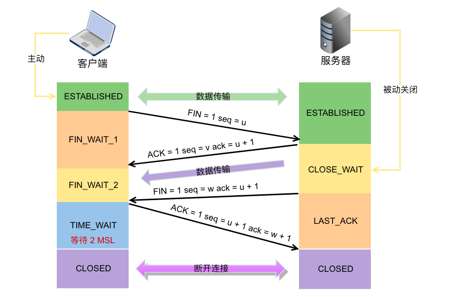

# TCP 协议详解

## TCP 特点

面向连接、字节流、可靠传输

## TCP 头

至少 5*4 = 20 字节，可选部分最多 40 字节（整体最多 60 字节）。

背过：
16 位源端口、16 位目的端口，32 位序号、32 位确认号；（12字节）
4 位头部长度（6 位保留）、6 位标志，16 位窗口；（4字节）
16 位校验和，16 位紧急指针；（4字节）
最多 40 位可选部分项。

- PSH 标志：告知接收端应该立即从 TCP 接收缓冲区中读走数据
- URG 标志：标记紧急指针是否有效，为 1 时告知启用 16 位紧急指针
- RST 标志：复位报文段标志，告知对方关闭连接或重连（端口占用、端口不存在、半打开连接下时会使用此选项）
- 16 为紧急指针：是个正的偏移量，与序号相加的值指向的*紧急数据的下一个字节位置*。

> 半打开连接
>
> 当连接的一方异常终止了连接，而对方没接收到结束报文段（如拔网线造成网络故障），此时一方还在维持连接而另一方已经没有该连接的任何信息了。这种状态称为半打开状态，此时连接被称为半打开连接。向半打开状态的连接写入数据，对方将回应 RST 报文
>
> 注：一旦发送 RST 标志，发送端所有在排队的发送数据都将在丢弃。

## 连接的建立与关闭

> [网上好博客参考（注意状态）](https://blog.csdn.net/jun2016425/article/details/81506353)
> [三次握手的内部实现参考](../tcpIpNetProgramming/README.md#三次握手的内部实现)
> [Time-wait 状态的理解与解决](../tcpIpNetProgramming/README.md#time-wait-状态的理解与解决)

TCP 连接失败会进行重连操作，重连次数由 `/proc/sys/net/ipv4/tcp_syn_retries` 变量定义，每次重连超时时间从 1s 开始翻倍。

## TCP 交互数据流和成块数据流

TCP 报文段按所携带应用程序数据的长度分为两种：交互数据和成块数据。

- 交互数据仅包含较少的字节，对实时性要求高，如 telnet、ssh
- 成块数据一般填满 TCP 报文段的最大允许长度，如 ftp

书中以这两个例子来介绍了抓包过程中出现的延迟确认机制、Nagle 算法、窗口控制（略）

## 带外数据

（略，紧急指针的使用）

## TCP 超时重传

## 拥塞控制

作用：提高网络利用率，降低丢包率，保证网络资源对每条数据流的公平性。

慢启动、拥塞避免、快速重传、快速恢复。（略，理解不深）