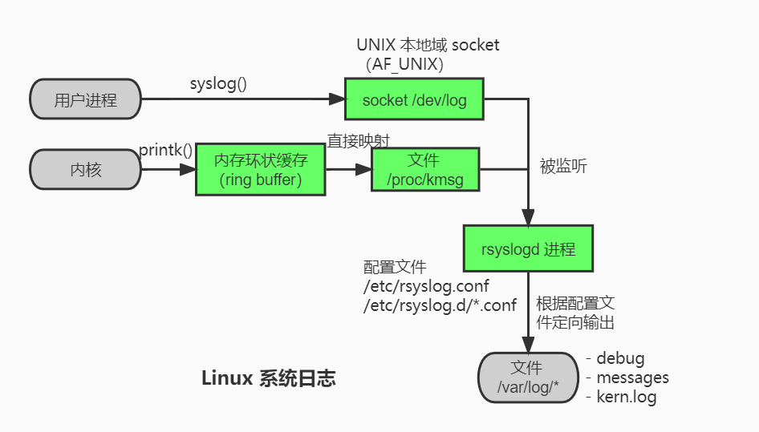

# 第七章 Linux服务器程序规范

**服务器程序**一般都是以后台方式运行的。**后台进程**又称**守护进程**（daemon）。

如果要写一个服务器程序运行在服务器上，需要有一定的规范。

- 运行方式：守护进程的父进程通常是 init 进程（PID 为 1 的进程）。
- 日志系统：大部分后台进程在 `/var/log/` 目录下有自己的日志目录。Linux 服务器通常有一套日志系统，至少输出日志到文件，有些高级服务器还能输出到专门的 UDP 服务器。
- 运行用户：一般以某个专用的非 root 身份运行。如 mysqld、httpd 都有自己的运行账户 mysql、apache。
- 配置文件：可以用配置文件来管理配置信息，一般这些配置文件在 `/etc/` 目录下，如 `/etc/squid3/squid.conf`。
- PID 记录：通常会在启动的时候生成一个 PID 文件存入 `/var/run/` 目录中，以记录该进程 PID。
- 资源限制

## 日志

linux 用一个守护进程来处理系统日志——syslogd，不过现在的 linux 都在用他的升级版——rsyslogd。（可通过 `ps -ef | grep syslogd` 或 `ps -C rsyslogd -f` 查看）

rsyslogd 守护进程既接收**用户进程**输出的日志，又接收**内核日志**。

用户进程可以调用 `syslog()` 生成系统日志。该函数会将日志输出到 UNIX 本地域 socket 类型（AF_UNIX）的文件 `/dev/log` 中，rsyslogd 监听此文件获取用户进程的输出。

内核日志又 `printk()` 等函数打印到内核的环状缓存（ring buffer）中，换装缓存映射到 `/proc/kmsg` 文件中，rsyslogd 监听此文件获得内核日志。

rsyslogd 获取到日之后，会把他们输出到特定的日志文件中。默认，调试信息保存到 `/var/log/debug` 文件；普通信息保存到 `/var/log/messages` 文件；内核消息保存到 `/var/log/kern.log` 文件。不过具体要看 `/etc/rsyslog.conf` 配置文件。

`/etc/rsyslog.conf` 配置文件可配置项：内核日志输入路径，是否接收 UDP 日志及器监听端口、是否接收 TCP 日志机器监听端口、日志文件的权限、加载子配置文件（`/etc/rsyslogd/*.conf`）



```c
void syslog(int priority, const char* message, ...); // 打印日志
// 改变 syslog 的默认输出方式，近一步格式化日志内容
void openlog(const char* ident, int logopt, int facility); 
int setlogmask(int maskpri); // 设置日志级别掩码
void clostlog(); // 关闭日志
```

## 用户信息

UID、EUID、GID、EGID。真实用户ID、有效用户ID、真实组ID、有效组ID。

- `有效xx ID` 的存在是为了方便资源访问：给真实用户赋予该程序有效权限之后的 ID。

例如：执行 su 程序时会提升普通用户的权限，但仍不是 root 身份的 ID，这就是 EUID。

```sh
chown root:root test_uid # 设置目标文件的所有者为 root
chmod +s test_uid # 设置目标文件的 set-user-id 标志（使用 euid）
```

```c
// 获取 ID
uid_t getuid();
uid_t geteuid();
gid_t getgid();
gid_t getegid();
// 设置 ID
int setuid(uid_t uid);
int seteuid(uid_t uid);
int setgid(gid_t gid);
int setegid(gid_t gid);
```

## 进程间关系

每个**进程组**都会有一个首领进程，他的 PGID 和 PID 相同。进程组一直存在，直到组内所有的进程都退出或移动到其他组。
一个进程可以设置自己的或其子进程的 PGID。但当进程调用了 exec 系列函数后，就不可以再在父进程中修改它的 PGID。

```c
pid_t getpgid(pid_t pid) // 获取
int setpgid(pid_t pid, pid_t pgid) // 设置
```

一些有关联的**进程组**将形成一个**会话**（session）

使用 ps 查看进程关系：

```
➜  ~ ps -o pid,ppid,pgid,sid,comm | less
   PID   PPID   PGID    SID COMMAND
 14303  14291  14303  14303 zsh
 14362  14303  14362  14303 ps
 14363  14303  14362  14303 less
```

如上，ps 和 less 命令是在 zsh 下执行的，所以：
- 三个进程共同形成一个 SID
- zsh 是另外两个的首领进程（PID==PGID）
- ps、less 进程的父进程是 zsh


## 系统资源限制

如：
- 物理设备限制：CPU数量、内存数量等
- 系统策略限制：CPU时间等
- 具体实现的限制：文件名的最大长度等

```c
int getrlimit(int resource, struct rlimit *rlim); // 获取系统资源限制
int setrlimit(int resource, const struct rlimit *rlim); // 设置系统资源
```

```c
struct rlimit // rlimit 的结构
{
    rlim_t rlim_cur; // 软限，建议性限制，超过的话系统可能会杀死进程
    rlim_t rlim_max; // 硬限，软限的上限
}
```

## 改变工作目录和根目录

如 Web 的逻辑根目录是 `/var/www/` 而非真实系统的根目录 `/`

```c
char* getcwd(char* buf, size_t size); // 获取当前进程的工作目录
int chdir(const char* path);  // 改变进程工作目录
int chroot(const char* path); // 改变进程的根目录（但不会改变工作目录）
```

> 改变进程的根目录后，程序无法访问类似 `/dev` 的目录，因为这些目录北非处于新的根目录之下，不过在调用 chroot 之后还可以使用调用之前打开的文件描述符。所以可以先创建文件描述符，再改变根路径。

## 服务程序后台化

让一个进程以守护进程的方式运行，需要遵循一定的步骤编程。

```
- 创建子进程后关闭父进程（fork 之后父进程的返回值为 0，子进程返回值大于 0，让父进程退出）
- 设置文件权限掩码
- 创建新会话，设置本进程为进程组的首领
- 切换工作目录为根 `/`
- 关闭标准输入设备、标准输出设备和标准错误输出设备
- 将标准输入、标准输出、标准错误输出都定向到 `/dev/null` 文件
```

linux 提供了同样的库函数 `int daemon(int nochdir, int noclose)`
