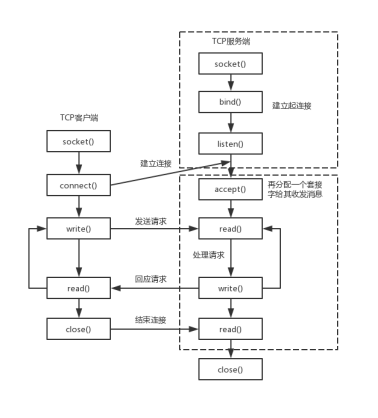

# 第八章 高性能服务器程序框架 {ignore=true}

（全书核心）

<!-- @import "[TOC]" {cmd="toc" depthFrom=1 depthTo=6 orderedList=false} -->

<!-- code_chunk_output -->

- [服务器模型](#服务器模型)
  - [C/S模型](#cs模型)
  - [P2P模型](#p2p模型)
- [服务器编程框架](#服务器编程框架)
- [IO模型](#io模型)
  - [阻塞 IO 和非阻塞 IO](#阻塞-io-和非阻塞-io)
  - [IO 复用和 SIGIO 信号](#io-复用和-sigio-信号)
  - [同步 IO 模型和异步 IO 模型](#同步-io-模型和异步-io-模型)
- [高效事件处理模式：Reactor 和 Proactor](#高效事件处理模式reactor-和-proactor)
  - [Reactor](#reactor)
  - [Proactor](#proactor)
  - [个人理解点](#个人理解点)
- [两种高效的并发模式](#两种高效的并发模式)
  - [半同步/半异步模式](#半同步半异步模式)
  - [领导者/追随者模式](#领导者追随者模式)
  - [高效编程方法：有限状态机](#高效编程方法有限状态机)
- [提高性能的其他建议：池、数据复制、上下文切换和锁](#提高性能的其他建议池-数据复制-上下文切换和锁)
  - [池](#池)
  - [数据复制](#数据复制)
  - [上下文切换](#上下文切换)
  - [锁](#锁)

<!-- /code_chunk_output -->

---

按一般原理将服务器解构为如下三个模块：

- IO处理单元：下文将介绍四种 IO 模型和两种高效事件处理模式
- 逻辑处理单元：下文将介绍两种高效并发模式，及高效的逻辑处理方式——有限状态机
- 存储单元

高性能服务器要考虑以下几处：

- 高效的事件处理模式：Reactor模式、Proactor模式
- 高效的并发模式：半同步/半异步模式、领导者/追随者模式
- 高效的逻辑处理单元：如有限状态机
- 池化技术
- 避免数据复制
- 避免上下文切换
- 避免锁或尽量减小锁的粒度


## 服务器模型

包含 C/S 模型和 P2P 模型。

### C/S模型



C/S 模型（客户端/服务器模型）适合资源相对集中的场合，并且实现也简单，缺点是服务器为通信的中心，当访问量过大时，可能所有客户都将得到很慢的响应。

### P2P模型

Peer to Peer，点对点。P2P 模型中每两台服务器互相相连。每台服务其在消耗服务的同时也给别人提供服务。

其缺点是：
- 当用户之间传输的请求过多时，网络的负载将加重。
- 主机发现问题需要专用一个服务发现

## 服务器编程框架

从设计的角度考虑服务器框架，需要考虑三部分，以及其中交互的两个连线：

```
IO处理单元 --(请求队列)-> 逻辑单元（处理程序） --(请求队列)-> 网络存储单元（可选） 
```

基本框架都一样，不同置出在于逻辑处理。

## IO模型

### 阻塞 IO 和非阻塞 IO

socket 在创建的时候默认是**阻塞的**，可通过参数控制 `SOCK_NONBLOCK` 或 `fcntl()` 设置为**非阻塞**。这就是阻塞IO和非阻塞IO，他们都是同步的（同步IO）。

- 阻塞 IO 执行系统调用可能因为无法立即完成而被操作系统挂起，直到等待的事件发生为止
- 非阻塞 IO 执行的系统调用则总是立即返回。通常要和其他 **IO 通知机制**一起使用，比如 **IO 复用**和 **SIGIO 信号**。

### IO 复用和 SIGIO 信号

- **IO 复用** 是最常用的 IO 通知机制，用户程序通过 IO 复用函数向内核注册一组事件，内核通过监听事件将就绪的事件通知给应用程序。常用的有 `select`、`poll`、`epoll_wait`。IO 复用函数本身也是阻塞的，他们能提高效率是因为他们具有同时监听多个 IO 事件的能力。

- **SIGIO 信号** 需要需要为目标文件描述符指定宿主进程，被指定的宿主进程将捕获到 SIGIO 信号。

### 同步 IO 模型和异步 IO 模型

从理论上来说，阻塞IO、IO复用、信号驱动IO 都是**同步 IO 模型**。因为他们都是在 IO 事件发生后由应用程序完成 IO 读写的。对于异步 IO 而言，用户对 IO 执行的读写操作会 **告诉内核读写缓冲区的位置**，以及读写完成之后 **内核通知应用程序的方式**。

- 同步 IO 模型：由用户完成 IO 读写；
- 异步 IO 模型：由内核完成 IO 读写，完成后通知应用程序。

可以这样认为：同步 IO 中，内核向应用程序通知的是 IO 就绪事件（然后由用户读写 IO）；异步 IO 中，内核向应用程序通知的是 IO 完成事件（内核已经完成 IO 读写）。

## 高效事件处理模式：Reactor 和 Proactor

Reactor 和 Proactor 是两种高效的事件处理模式。

同步 IO 模型长用于实现 Reactor 模式；异步 IO 模型则用于实现 Proactor 模式。（不过也可以用同步 IO 的方式模拟处 Proactor 模式）


### Reactor

Reactor 是这样一种模式，它要求主线程（IO 处理单元）只负责监听文件描述符上是否由事情发生，然后通知工作线程（逻辑单元）处理。

- 主线程责任：只监听事件，通知工作线程
- 工作线程责任：读写数据，接受新连接，业务逻辑

流程（以 epoll_wait 为例）：

- 主线程向内核（epoll 内核事件表）注册 socket **读就绪事件**
- 主线程调用 epoll_wait 等待 socket 上由数据可读（**监听事件**）
- 当 socket 有数据可读时，epoll_wait 通知主线程，主线程将 socket 可读事件放入请求队列（**通知工作线程**）
- 睡眠在请求队列上的工作线程被唤醒，从 socket 读数据，并处理请求，然后向内核注册该 socket 的写就绪事件
- 主线程调用 epoll_wait 等待 socket 可写
- 当主线程收到信号 socket 可写时，将 socket 可写事件放入请求队列
- 在请求队列中的工作线程被唤醒，向 socket 上写入响应

### Proactor 

Proactor 模式将**所有 IO 操作**（包含读写）都交给**主线程和内核**（注意是两者）来处理，工作线程只负责业务逻辑。

- 主线程责任：监听事件，接受连接，读写数据，通知工作线程
- 工作线程责任：业务逻辑

流程（以 aio_read、aio_write、信号 sigevent 为例）：

- 主线程通过 aio_read() 向内核注册 **读完成** 事件（会告诉内核 **用户读缓冲区** 的位置，及读完成后如何通知应用程序，如信号）
- 主线程处理其他逻辑
- 当 socket 已经被读入 **用户缓冲区** 后，内核通知应用程序数据已经可用
- 应用程序通过工作线程处理请求
- 应用程序通过 aio_write 向内核注册 socket 上写完成事件，并告诉内核 **用户缓冲区** 的位置及完成后如何通知应用程序
- 内核将 **用户缓冲区** 的数据写入 socket 后，内核将通知应用程序发送完毕
- 应用程序根据 发送完毕 信号处理善后工作，如关闭 socket

### 个人理解点

- 主线程和工作线程都是开发者控制的，他们都在和内核互相作用。
- 差别点：主线程的责任，是只负责事件通知，还是再加上读写的数据

附：

- [彻底搞懂Reactor模型和Proactor模型 - 腾讯云](https://cloud.tencent.com/developer/article/1488120)
- [Go 的 protoactor 模型库](https://github.com/asynkron/protoactor-go)
- [彻底搞懂Redis的线程模型](https://mp.weixin.qq.com/s?__biz=MzUyNzgyNzAwNg==&mid=2247483945&idx=1&sn=1524a8ebf7adbdf61a98369c7f8ab145&scene=21#wechat_redirect)（Redis 使用 Reactor 模型）

## 两种高效的并发模式

两种高效的并发模式：半同步/半异步模式 和 领导者/追随者模式。

并发对于 IO 密集型程序，可以缓解 IO 瓶颈以充分利用 CPU 提高效率；但对于计算密集型由于任务频繁的切换会使效率降低。

并发模式是指：IO 处理单元和多个逻辑单元之间协调完成任务的方法。

### 半同步/半异步模式

并发中，同步表示程序安装代码序列顺序执行；异步是指程序的执行是否需要由系统事件来驱动。常见的事件包括中断、信号等。

> 这里的同步、异步是说的线程的同步、异步

- 异步优点：执行效率高，实时性强
- 异步缺点：编写复杂，调试复杂，扩展复杂
- 同步优点：编写简单
- 同步缺点：执行效率低，实时性低

半同步/半异步模式 中同时使用了同步线程和异步线程，同步线程用在处理客户逻辑，异步线程用于处理 IO 事件。

异步线程监听到客户请求后，将其封装成请求对象，插入到请求队列中工作线程从请求队列中读取请求并处理。

请求队列的设计和工作线程的设计据情况而定，存在多种变体，其中一种变体为 **半同步/半反应堆模式**（half-sync/half-reactive）。
主线程插入请求队列的连接是就绪的连接 socket，这就是该模式中“half-reactive”的含义。
它可以采用的事件处理模式是 Reactor 模式，要求工作线程从 socket 中读请求，并向 socket 中写响应；也可以采用 Proactor 模式，主线程将应用数据、任务类型封装成一个任务对象，然后插入请求队列由工作线程处理。

半同步/半反应堆模式有如下缺点：

- 主线程和工作线程共享请求队列，因此要有锁的控制，会耗费 CPU 时间。
- 每个工作线程同一时间只能处理一个请求，如果请求数量过多会导致请求队列积压任务，如果通过增加工作线程来解决，则工作线程的切换将耗费大量 CPU 时间。

以上解决方法：每个工作线程再用 epoll 来监听自己的事件循环，请求来时由主线程向工作线程中派发 socket。

### 领导者/追随者模式

领导者/追随者模式模式是多个工作线程轮流获得事件源集合，轮流监听、分发并处理事情的一种模式。

在任意时间点，程序都仅有一个领导者线程，负责监听 IO 事件，而其他线程则都是追随者，休眠在线程池中等待新的领导者。

### 高效编程方法：有限状态机

有限状态机（Finite State Machine）是逻辑处理单元内一种高效编程方法。

有的应用层协议（如 sip）头部包含数据包类型字段，每种类型映射到一种逻辑处理方法，这就需要一个简单的有限状态机。状态的转移是需要状态机内部驱动实现的。

## 提高性能的其他建议：池、数据复制、上下文切换和锁

以上讨论了提供性能的高效事件处理模式、高效的并发模式、高效的逻辑处理方式（有限状态机），进一步提高性能还由以下几个方面：锁、数据复制、上下文切换和锁。

### 池

池是用空间换时间的一种方法。池是一组资源的集合，这组资源在服务器启动之初就被创建并初始化好，这称为**静态资源分配**。常见的池有内存池、进程池、线程池和连接池。

内存池，常用于 socket 接收缓存和发送缓存，对于长度有限的请求，预先分配足够的缓冲区，当请求长度超过缓冲区的大小时，可以选择丢弃请求或扩大缓冲区。

进程池和线程池。

连接池通常用于服务器或服务器集群的内部永久连接。如预先和数据库程序建立一组连接的集合，当某个逻辑单元需要访问时，直接从池中取一个连接的实体使用即可。

### 数据复制

高性能服务器应该避免不必要的数据复制，尤其是当数据复制发生在用户代码和内核之间的时候。

如 ftp 服务器无须把目标文件完整读入应用程序缓冲区，这个时候使用 **零拷贝函数** 如 sendfile() 直接将器发送到客户端。

用户空间（不访问内核）内的数据复制也应该避免。当两个工作进程之间要传递大量的数据时，我们应该考略使用共享内存来共享数据，而不是使用管道或消息队列来传递。

### 上下文切换

并发程序必须考虑上下文切换的问题，进程切换或线程切换会导致系统开销。多线程服务器的一个优点时不同线程可以同时运行在不同的 CPU 上，当线程数量不大于 CPU 数目时，上下文的切换就不是问题了。

### 锁

并发程序需要考虑的另一个问题时共享资源加锁保护的问题。

引入锁的代码不仅不处理任何业务逻辑，而且需要访问内核资源，因此导致服务器效率低下。

服务器应当尽量避免锁，或尽量减小锁的粒度，比如用读写锁。（读写锁只当其中一个工作线程需要写这块内存的时候才会锁住这块区域。）

---

这章知识点很多，有些是自己已经知道的，但之前都“只是知道”，但并不了解其意义重大，多复习一下这里很有必要。