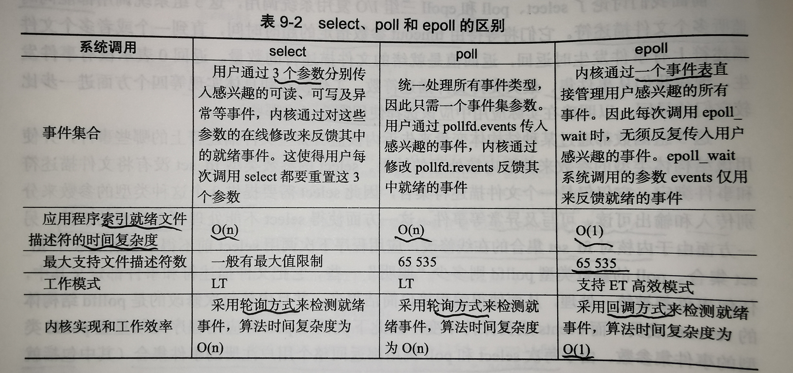

# I/O 复用

Linux 实现I/O复用的系统调用主要有 select、poll 和 epoll。

## select 系统调用

用途：在一段指定的时间内，监听注册的文件描述符上的可读、可写和异常等事件。

```c
int select(int nfds, fd_set* readfds, fd_set* writefds, fd_set* exceptfds, struct timeval* timeout);
```
- nfds 是监听的文件描述符的总数，通常被设置为监听最大文件描述符的值 + 1（因为类型 int，且计数从 0 开始）.
- readfds, writefds, exceptfds 分别是 可读、可写、异常事件对应的文件描述符集合。
- fd_set 类型中包含一个整型数组，数组中元素的每一 bit 标记一个文件描述符
- timeout 参数用于控制超时时间（微秒级，NULL 一直阻塞）

select 返回成功时返回就绪（包含可读、可写、异常）的文件描述符的总数。超时返回 0，调用错误会返回 -1。

使用 select 的工作流程：

1. 初始化 读fd、写fd、异常fd（以下统称为 事件 fd）
2. 事件 fd 们每个位清零
3. while 大循环（可以是死循环）
4. 设置事件 fd 中对应的 fd 位（bit）
5. 调用 select 监听
6. 当返回时根据对应 bit 循环获取到 fd，并处理
7. 返回到 while 大循环 3 处继续执行


select 因为“古老”，跨平台性比较好。但缺点也很明显：

- 每次调用 select 的时候都需要把所有的监听的 事件fd 传入到内核（用户态到内核态的拷贝）
- 在调用 select 阻塞期间，无法再添加监听事件
- 返回事件后，还需要用户程序通过循环找到对应事件的 fd（O(n)）
- 大循环下需要每次重置 事件fd 的所有位（因为内核改对应位表示对应 fd 有事件发生）


## poll 系统调用

poll 和 select 类似，也是指定事件内轮询一定数量的文件描述符。

```c
int poll(struct pollfd* fds, nfds_t nfds, int timeout);

struct pollfd {
    int fd;        // 文件描述符
    short events;  // 注册的事件
    short revents; // 由内核填充，表明发生的事件
}
```

- fds 是个数组，地址指向文件描述符数组的第一个元素
- nfds 是指定 fds 的大小
- timeout 超时时间

poll 工作主要流程（说一下主要机制，很多和 select 一样的地方省略了）：
- 当用户调用后会阻塞直到有事件发生
- 事件发生会设置对应 fds[].revents
- 用户程序需要遍历 fds 数组来找有事件的 revents
- ...

poll 优点：

- 不再有 1024 的限制，可以根据需要设置大小
- 相比于 select 监听事件入参和返回分开了，好处理些

缺点：

- 存储文件描述符的链表仍需要从用户态拷贝到内核态（？疑问）
- 仍然需要用户遍历数组获取到事件（O(n)）
- 仍然不能动态添加 fd（数组无法扩充）
- 工作模式为 水平触发（LT），不支持边沿触发（ET），效率较低

> 缺点 1 是从[网上](https://blog.csdn.net/bingbangbingbang/article/details/105352839)拷贝来的，有一点疑问：难道指针传递也会发生拷贝吗？

## epoll 系统调用

epoll 是 linux 特有的 IO 复用函数。与 select poll 的实现差异较大。

epoll 把用户关心的文件描述符上的事件注册到 **内核中的事件表** 中，从而无须像 select poll 那样重复传入 fd 或事件集，而是用了一个额外的文件描述符唯一标识内核中的这个事件表。

```c
int epoll_create(int size); // 创建一个 epoll 的文件描述符（红黑树的根节点）
int epoll_ctl(int epfd, int op, int fd, struct epoll_event *event); // 增删改监听的事件
int epoll_wait(int epfd, struct epoll_event* events, int maxevents, int timeout);
```

- epoll_create 返回一个文件描述符 epfd，指向要访问的内核事件表
- epfd 是指 epoll_create 返回的文件描述符，是另外两个函数的第一个参数
- epoll_wait 在有事件时返回就绪文件描述符的个数，将所有就绪事件放到第二个参数中

epoll 优点：

- 最高效的变化在于将就绪事件集统一放到一个参数中返回，极大低提高了应用程序索引就绪fd 的效率（O(1)）。

### epoll 的 LT 和 ET 模式

- LT，Level Trigger，电平触发。epoll 的默认工作模式，只算是 poll 的高效版。
- ET，Edge Trigger，边沿触发。此模式下为 epoll 的高效工作模式。

在 LT 下，当 epoll_wait 有事件时，应用程序可以不立即处理该事件，如果这样，当程序下一次调用 epoll_wait 时，epoll_wait 会再次通告此事件，直到此事件被处理掉。

在 ET 下，应用程序必须立即处理该事件，因为后序 epoll_wait 不会再通告此事件。因此比 LT 模式效率更高。

### epoll 的 EPOLLONESHOT 事件

避免竞态。TODO

## 三种 IO 复用差异对比

- select
    - 用三个数组传入分别表示可读、可写、异常事件，使得不能处理更多事件
    - 内核对 fd_set 在源数据上在线修改，应用下次调用不得不重置
    - 每次都返回整个注册的事件集合，索引就绪事件复杂度 O(n)
    - 只有 LT 模式
    - 用户态到内核态拷贝
    - 允许监听的最大 fd 个数受限，虽然可调，但会导致不可预期的后果。
- poll
    - (优化点) 将就绪事件用不同的字段表示，使得避免了下次循环重置信息的操作
    - 索引就绪事件复杂度仍为 O(n)
    - 只有 LT 模式
    - 用户态到内核态拷贝
    - 允许监听的最大 fd 达到系统最大 65535（cat /proc/sys/fs/filemax）
- epoll
    - 使用了三个函数，不同的策略来实现向内核注册事件，无须反复从用户空间传入
    - 通过单独的 events 数组返回就绪事件，索引复杂度将为 O(1)
    - 允许监听的最大 fd 达到系统最大 65535（cat /proc/sys/fs/filemax）

