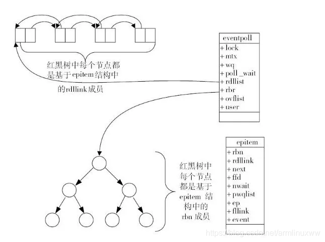

# I/O 复用

要点：
1. select 函数定义及工作原理
2. poll 函数定义及工作原理
3. epoll 函数定义及工作原理
4. 三者优劣

---

Linux 实现I/O复用的系统调用主要有 select、poll 和 epoll。

## select 系统调用

用途：在一段指定的时间内，监听注册的文件描述符上的可读、可写和异常等事件。

```c
int select(int nfds, fd_set* readfds, fd_set* writefds, fd_set* exceptfds, struct timeval* timeout);
// fd_set 结构的定义有些复杂，总的来说内部定义的是个数组，数组每个元素的每一位标记一个文件描述符
// fd_set 能容纳的文件描述符的数量由 FD_SETSIZE 指定，为 1024
```
- nfds 是监听的文件描述符的总数，通常被设置为监听最大文件描述符的值 + 1（因为类型 int，且计数从 0 开始）.
- readfds, writefds, exceptfds 分别是 可读、可写、异常事件对应的文件描述符集合。
- fd_set 类型中包含一个整型数组，数组中元素的每一 bit 标记一个文件描述符（如 `0...01100` 标记了 `fd=2, fd=3`）
- timeout 参数用于控制超时时间（微秒级，NULL 一直阻塞）

select 返回成功时返回就绪（包含可读、可写、异常）的文件描述符的总数。超时返回 0，调用错误会返回 -1。

select 的工作流程：当有事件发生时，内核会改变三种 fds 参数的对应位来表明对应 fd 上出现事件，并返回就绪数量。

开发者使用 select 的工作流程：

1. 初始化 读fds、写fds、异常fds（以下统称为 事件fds）
2. 事件 fds 的所有位清零（初始化）
3. while 大循环（可以是死循环）
4. 根据监听的 fd 设置对应 事件fds 中对应的位（因为内核收到事件后会改变对应位，所以在大循环内要重设一次）
5. 调用 select 监听
6. 当返回时根据循环对应 bit 获取到变化的 fd，并进行处理
7. 返回到 while 大循环 3 处继续执行

select 因为“古老”，跨平台性比较好。但缺点也很明显：

- 每次调用 select 的时候都需要把所有的监听的 事件fd 传入到内核（用户态到内核态的拷贝）
- 在调用 select 阻塞期间，无法再添加监听事件
- 返回事件后，还需要用户程序通过循环找到对应事件的 fd（O(n)）
- 大循环下需要每次重置 事件fd 的对应位（因为内核改对应位表示对应 fd 有事件发生）


## poll 系统调用

poll 和 select 类似，也是指定事件内轮询一定数量的文件描述符。

```c
int poll(struct pollfd* fds, nfds_t nfds, int timeout);

struct pollfd {
    int fd;        // 文件描述符
    short events;  // 注册的事件
    short revents; // 由内核填充，表明发生的事件
}
```

- fds 是个数组，地址指向文件描述符数组的第一个元素
- nfds 是指定 fds 的大小
- timeout 超时时间

poll 工作主要流程（说一下主要机制，很多和 select 一样的地方省略了）：
- 当用户调用后会阻塞直到有事件发生
- 事件发生会设置对应 fds[i].revents
- 用户程序需要遍历 fds 数组按 revents 找到发生的事件
- ...

poll 优点：

- 不再有 1024 的限制，可以根据需要设置大小
- 相比于 select 监听事件入参和返回分开了，好处理些

缺点：

- 存储文件描述符的数组仍需要从用户态拷贝到内核态
- 仍然需要用户遍历数组获取到事件（O(n)）
- 仍然不能动态添加 fd（阻塞了没法添加）
- 工作模式为 水平触发（LT），不支持边沿触发（ET），效率较低

## epoll 系统调用

epoll 是 linux 特有的 IO 复用函数。与 select poll 的实现差异较大。

epoll 把用户关心的文件描述符上的事件注册到 **内核中的事件表** 中，从而无须像 select/poll 那样重复传入 fd 或事件集，而是返回了一个文件描述符唯一标识内核中的这个事件表。

```c
int epoll_create(int size); // 创建一个 epoll 的文件描述符（红黑树的根节点）
int epoll_ctl(int epfd, int op, int fd, struct epoll_event *event); // 增删改监听的事件
int epoll_wait(int epfd, struct epoll_event* events, int maxevents, int timeout);
```

- epoll_create 返回一个文件描述符 epfd，指向要访问的内核事件表
- epfd 是指 epoll_create 返回的文件描述符，是另外两个函数的第一个参数
- epoll_ctl 用于动态增删改需要监听的 fd
- epoll_wait 在有事件时返回就绪文件描述符的个数，并将所有就绪事件放到第二个参数中
    - 注意 events 不可以是空指针，内核只是复制，不会帮用户态分配内存
    - 第三个参数表示本次可以返回的最大事件数目（通常是 events 数组的长度）

epoll 优点：

- 最高效的变化在于将就绪事件集统一放到一个参数中返回，极大低提高了应用程序索引就绪fd 的效率（O(1)）。
- 大循环下不会每次都发生大数据量的内存拷贝
- 更多参考下文

### epoll 的 LT 和 ET 模式

- LT，Level Trigger，电平触发。epoll 的默认工作模式，此模式下只算是 poll 的高效版。
- ET，Edge Trigger，边沿触发。此模式下为 epoll 的高效工作模式。

在 LT 下，当 epoll_wait 有事件时，应用程序可以不立即处理该事件，如果这样当程序下一次调用 epoll_wait 时，epoll_wait 会再次通告此事件，直到此事件被处理掉。

在 ET 下，应用程序必须立即处理该事件，因为后序 epoll_wait 不会再通告此事件。因此比 LT 模式效率更高。

### epoll 的 EPOLLONESHOT 事件

避免竞态。TODO

## 三种 IO 复用差异对比

- select
    - 用三个数组传入分别表示可读、可写、异常事件，使得不能处理更多事件
    - 内核对 fd_set 在源数据上在线修改，应用下次调用不得不重置
    - 每次都返回整个注册的事件集合，索引就绪事件复杂度 O(n)
    - 只有 LT 模式
    - 用户态到内核态拷贝
    - 允许监听的最大 fd 个数受限，虽然可调，但会导致不可预期的后果。
- poll
    - (优化点) 传入内核一个数组，将就绪事件用元素中额外的字段标识，使得避免了循环中重置信息的操作
    - 索引就绪事件复杂度仍为 O(n)
    - 只有 LT 模式
    - 用户态到内核态拷贝
    - 允许监听的最大 fd 达到系统最大 65535（`cat /proc/sys/fs/filemax`）
- epoll
    - 使用了三个函数，用不同的策略来实现向内核注册事件，无须反复从用户空间传入
    - 通过单独的 events 数组返回就绪事件，索引复杂度将为 O(1)
    - 允许监听的最大 fd 达到系统最大 65535（`cat /proc/sys/fs/filemax`）


## 扩展 

### epoll 内部实现

> 来自 《深入理解 Nginx》
 
 select 和 poll 存在的明显问题是：

- 系统调用时传入了所有的 fd，发生了用户态内存到内核态内存的大量拷贝
- 内核会遍历这些事件造成资源浪费。

上文中提到了，epoll 将这个过程分为了三个函数，那 epoll 是如何高效处理事件的呢？

- 当调用 epoll_create 时会创建 epoll 对象 eventpoll 结构体。
- epoll_ctl 方法会向 epoll 对象中添加事件，挂到 rbr 红黑树中。
- 所有向 epoll 添加的事件都会与设备（如网卡）驱动程序建立回调关系。
- 当有事件发生时会调用这里的回调方法 ep_poll_callback。
- ep_poll_callback 方法会为事件创建一个 opitem 结构体并放到一个双向链表 rdllist 中（数组）
- 当调用 epoll_wait 时，只是检查 eventpoll 对象中的 rdllist 是否有 epitem 元素
- 当 rdllist 非空时，内核把事件复制到用户态内存中（用户传入的第二个参数地址）同时返回事件数量

```c
struct eventpoll {
    // 红黑树的根节点，挂载所有监控的事件
    struct rb_root_rbr; 
    // 双向列表，保存着已经发生的事件
    struct list_head rdllist;
    ...
};

struct epitem {
    // 红黑树结点
    struct rb_node rbn;
    // 双向链表结点
    struct list_head rdllink;
    // 事件句柄等信息
    struct epoll_filefd ffd;
    // 指向所属的 eventpoll 对象
    struct eventpoll *dp
    // 期待的事件类型
    struct epoll_event event;
    ...
};
```



### LT/ET 模式的比较

> 来自 《深入理解 Nginx》

默认 epoll 工作在 LT 模式下，可以处理阻塞和非阻塞的套接字；ET 模式效率要比 LT 模式高，它只支持非阻塞套接字。

ET 与 LT 模式的区别在于：
- 当一个新的事件到来时， ET 模式下当然可以从 epoll_wait 调用中获取到这个事件，可是如果这次没有把这个事件对应的套接字缓冲区处理完，在这个套接字没有新的事件再次到来之前无法再次从 epoll_wait 中获取到这个事件；
- 而 LT 模式则相反，只要一个事件对应的套接字缓冲区还有数据，就总能从 epoll_wait 中获取这个事件。

因此 LT 模式下的开发相对简单一些，不容易出错。Nginx 是工作在 ET 模式下的。