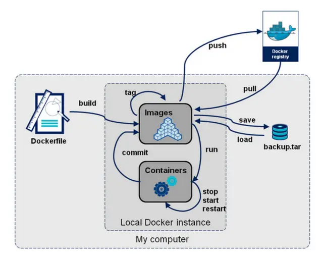

# docker

[官网](https://docs.docker.com/)

## 安装

https://docs.docker.com/engine/install/ubuntu/
https://cn.linux-console.net/?p=4837

```sh
# ubuntu 18.04 安装 docker
sudo apt-get update
sudo apt-get install ca-certificates curl
sudo install -m 0755 -d /etc/apt/keyrings
apt install docker.io

vim /etc/docker/daemon.json # 配置 docker 镜像源
# {
#   "registry-mirrors": ["https://hub-mirror.c.163.com", "https://mirror.baidubce.com", "https://ccr.ccs.tencentyun.com", "https://dockerproxy.com"]
# }

systemctl restart docker.service # stop + start
docker pull ubuntu:18.04
```

## 命令流转



```yml
docker commit [-a "author"] [-m "message"] CONTAINER_ID  REPO[:TAG]

docker run [OPTIONS] IMAGE [COMMAND] [ARG...]
docker run -itd arm64v8/freeswitch:v1.0 # 交互式运行起来
docker run -itd --net=host arm64v8/freeswitch:v1.0 # 交互式运行起来
docker run -d [--rm] [-p [HOST:]PORT:DOCKER_PORT[/PROTOCOL]] [--net=host] [--name=NAME] [--env-file=[]] [--link=[]] [-v HOST_PATH:DOCKER_PATH] IMAGE COMMAND ARG...

docker save -o NAME.tar IMAGE:TAG
```

## 制作一个 FreeSWITCH 镜像

```sh
docker pull ubuntu:18.04
```

## ARM 上使用 docker

### 下载 arm ubuntu 镜像

- [参考文章：下载 ARM 架构镜像](https://blog.csdn.net/weixin_43645454/article/details/130270712)
- [DockerHub arm64v8/ubuntu 镜像](https://hub.docker.com/r/arm64v8/ubuntu/tags)

```sh
vim /etc/docker/daemon.json
# {
#     "registry-mirrors": ["https://dockerhub.icu"]
# }
docker pull arm64v8/ubuntu:oracular
docker run -itd arm64v8/ubuntu:oracular
```
