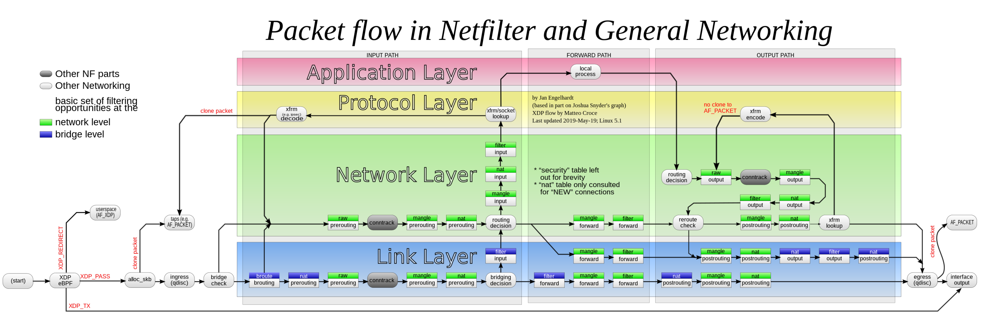

# iptables

参考：
https://wiki.archlinuxcn.org/wiki/Iptables?rdfrom=https%3A%2F%2Fwiki.archlinux.org%2Findex.php%3Ftitle%3DIptables_%28%25E7%25AE%2580%25E4%25BD%2593%25E4%25B8%25AD%25E6%2596%2587%29%26redirect%3Dno#%E5%AE%89%E8%A3%85

- iptables 是 ipv4 的内核级防火墙，ip6tables 用于 ipv6；
- 用于 检测、修改、转发、重定向、丢弃 IPv4 的数据包；
- iptable 是用户工具，允许使用 链 和 规则（相当于内核层提供的接口）
- iptables 对任何 IP（可能有多个 IP）进入的数据包进行相同的处理
- `TABLEs`: iptables 有 5 张表，大部分情况需要 nat 和 filter 表
    - `raw`，用于配置数据包不被系统跟踪
    - `filter`，用于存放于防火墙相关操作的默认表
    - `nat`，用于网络地址转换
    - `mangle`，用于对特定数据包修改
    - `security`，用于强制访问控制的网络路由
- `CHAINs`: iptables 中的 链（chains），链组成表，链是规则的集合
    - `filter` 表包含 `INPUT`、`OUTPUT`、`FORWARD` 三条链
    - nat 表包含 `PREROUTING`、`POSTROUTING`、`OUTPUT` 三条链
    - 用户可以自定义链，添加到表中
- `RULEs`: iptables 中的 规则（Rules），过滤根据规则进行
    - 规则由 匹配条件 matches 和 目标 target 组成
    - 规则有三个基本匹配：包入网接口（eth0、eth1 等）、协议类型（ICMP、TCP、UDP 等）、包的目的端口
    - 默认情况下，链中没有规则。默认规则通常为 ACCEPT
    - 目标 targets 作用 -j 或 --jump 指定
    - targets 可以是自定义的，也可以是内置的；内置的有默认的策略
    - 内置的 target 有：ACCEPT、DROP、QUEUE、RETURN 四种，扩展 target 有 REJECT、LOG 等


```sh
# 查询 IP 地址，IP 白名单：北京公司、t2-cti、s4-cti1
curl -X POST "https://route.showapi.com/20-1?showapi_appid=1790171&showapi_sign=b3113d0f58c4438297b743579ede6b02" --data "ip=218.105.5.134"

# 查看当前规则和匹配数
iptables -nvL
# 屏蔽某号码段
sudo iptables -I INPUT -s 108.181.18.191/24 -j DROP
sudo iptables -I INPUT -s 203.170.225.250/24 -j DROP

sudo iptables-save > save.iptables # 保存规则
sudo iptables-restore < save.iptables # 从文件中恢复规则

# 删除转发规则
sudo iptables -D FORWARD -i eth0 -o <vpn接口> -j ACCEPT
sudo iptables -D FORWARD -i <vpn接口> -o eth0 -j ACCEPT

# 删除 NAT 规则
sudo iptables -t nat -D POSTROUTING -s 192.168.1.0/24 -d 10.0.4.0/24 -j MASQUERADE

sudo iptables -L FORWARD --line-numbers # 查看规则，num 表示编号
sudo iptables -D FORWARD N  # 删除 N 编号
```


