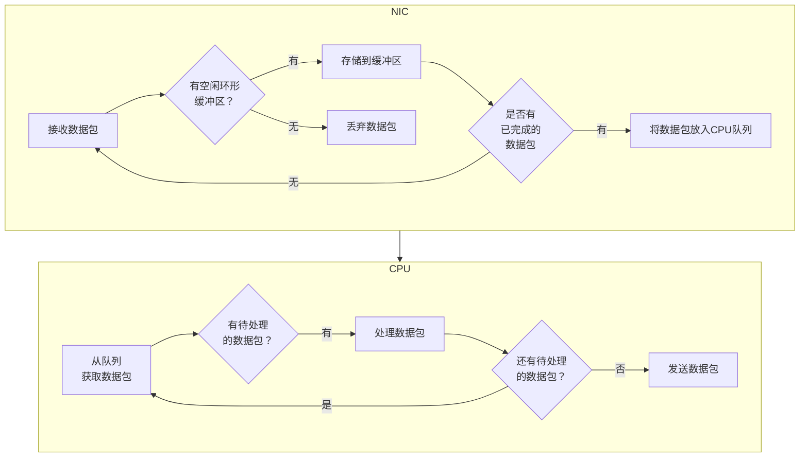
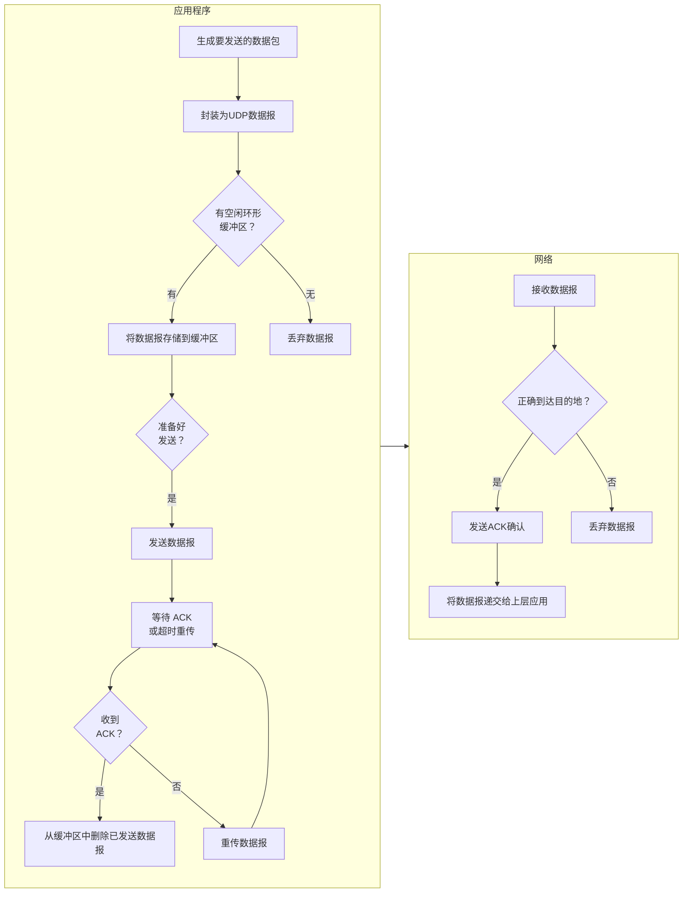

## 总结

经过分析：
- 通过网卡信息可看是否有丢包。ifconfig 看 RX/TX（收到/发送）的 drop 数据
- 应用层封装的数据包。所以 rtp 包中 seq 连续但不是 20ms 一个能证明是应用层封装数据慢了


## 从 ChatGPT 获取的信息

> ChatGPT 可能不准确，因为 UDP 没有 ACK，有参考价值。

udp nic ring buffer cpu 队列 buffer 工作流程图

以下是一个基本的UDP网络接口卡（NIC）环形缓冲区和CPU队列的工作流程图：



上述工作流程图表示了以下几个步骤：

- NIC接收数据包。
- 检查是否有空闲的环形缓冲区可用。
- 如果有空闲缓冲区，将数据包存储到缓冲区中；如果没有空闲缓冲区，则丢弃该数据包。
- 检查是否有已完成的数据包。
- 如果有已完成的数据包，将其放入CPU队列中等待处理。
- CPU从队列中获取数据包进行处理。
- 如果有待处理的数据包，处理该数据包。
- 如果还有待处理的数据包，返回步骤6；否则，发送数据包。
- 这是一个简化的工作流程图，用于描述 UDP NIC 环形缓冲区和 CPU 队列之间的基本交互。实际情况可能会更加复杂，具体取决于系统的设计和需求


udp 流出示意图

以下是一个基本的UDP数据流出流程图：



上述工作流程图表示了以下几个步骤：

- 应用程序生成要发送的数据包。
- 数据包被封装为UDP数据报。
- 检查是否有空闲的环形缓冲区可用。
- 如果有空闲缓冲区，将数据报存储到缓冲区中；如果没有空闲缓冲区，则丢弃该数据报。
- 检查是否已准备好发送数据报。
- 如果已准备好发送，将数据报发送到网络中。
- 等待接收端的ACK确认或超时重传。
- 如果接收到ACK确认，从缓冲区中删除已发送的数据报。
- 如果未接收到ACK确认，重传数据报并返回步骤7。
- 接收端接收到数据报。
- 检查数据报是否正确到达目的地。
- 如果数据报正确到达目的地，发送ACK确认。
- 将数据报递交给上层应用程序进行处理。
- 这是一个简化的工作流程图，用于描述UDP数据流出的基本交互。实际情况可能会更加复杂，包括错误处理、拥塞控制等机制，具体取决于系统的设计和需求

## 定位手段

[参考文章](https://zhuanlan.zhihu.com/p/609999730)中说其在生产环境中，因 Ring Buffer 写满导致丢包的情况很多。当业务流量过大且出现网卡丢包的时候，考虑 Ring Buffer 写满是一个很好的思路。

以下是 ethtool 工具的使用。另外 `ifconfig eth0` 也能看到网卡对应的统计信息，ifconfig 对应的是 `/proc/net/dev` 设备文件，也可查阅。

https://ylgrgyq.github.io/2017/07/23/linux-receive-packet-1/

### 查看 Ring Buffer 大小

```sh
ethtool -g eth0
# 输出
Ring parameters for eth0:
Pre-set maximums:
RX:             4096 # 最大是 4096
RX Mini:        0
RX Jumbo:       0
TX:             4096
Current hardware settings:
RX:             4096 # 当前是 4096
RX Mini:        0
RX Jumbo:       0
TX:             4096
```

### 查看统计信息

```sh
ethtool -S eth0
# 输出
no stats available # 可能是不支持（驱动、硬件、未联网、未启用等）
```

### 查看 Ring Buffer 队列数量

```sh
ethtool -l eth0
# 输出
Channel parameters for eth0:
Pre-set maximums:
RX:             0
TX:             0
Other:          0
Combined:       1
Current hardware settings:
RX:             0
TX:             0
Other:          0
Combined:       1
```

### 更改参数

```sh
ethtool -L eth0 combined 8 # 更改 eth0 网卡 Combined 的值（ethtool 可能都要重启生效）
ethtool -G eth0 rx 4096    # 设置 RX 队列大小
ethtool -G eth0 tx 4096    # 设置 TX 队列大小
# 调整 Ring Buffer 队列的权重
```
