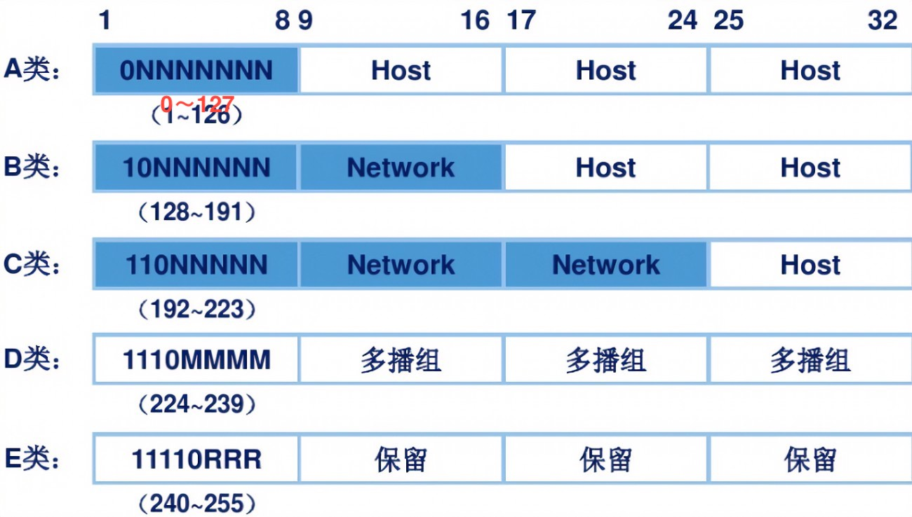

# TCP/IP 网络编程

先按章节整理，随后整合按自己想的分节。

## 第一章 理解网络编程和套接字

网络编程，就是编写程序让两台联网的计算机进行通信（或者说进行交换数据）。

套接字，是网络数据传输用的软件设备，所以网络编程又叫套接字编程。

服务端调用 socket 一般流程：

- socket() 创建一个套接字
- bind() 绑定地址
- listen() 监听 socket 信息，并设置缓冲（第二个参数为连接请求等待队列的大小）
- accept() 受理请求
- read/write() 向 socket 中读/写数据
- close() 关闭套接字

客户端调用 socket 的一般流程：

- socket() 创建一个套接字
- connect() 连接对端套接字
- read/write() 向 socket 中读/写数据
- close() 关闭套接字

### 套接字与协议设置

创建套接字的函数：

```c
#include <sys/socket.h>
int socket(int, int, int); // 参数分别为：协议族，套接字类型，协议名称（当某协议族下某套接字类型下只有一种套接字时，第三个参数可以为空值 0）

// 如，创建一个 tcp socket
int tcp_socket = socket(PF_INET, SOCK_STREAM, IPPROTO_TCP);
```

第一个参数为协议族（Protocol Family）；第二个参数为套接字类型（Type）；第三个参数为协议名称，若传输类型下只有一种协议则可以传递空值 0，否则必须填指定的协议名称（如：IPPROTO_TCP、IPPROTO_UDP）。

#### 协议族（Protocol Family）

一种协议的分类信息。C语言中你可能常会看到 `PF_` 前缀的常量，就表示一种协议族信息。如：

- PF_INET：IPv4 互联网协议族
- PF_INET6：IPv6 互联网协议族
- PF_LOCAL：本地通信的 UNIX 协议族
- PF_PACKET：底层套接字协议族
- ……


#### 套接字类型（Type）

套接字类型是套接字数据传输的方式。两种代表性的传输类型：

- SOCK_STREAM：面向连接的套接字，如 IPv4 协议族下的 TCP
- SOCK_DGRAM：面向消息的套接字，如 IPv4 协议族下的 UDP

##### 面向连接的传输方式

面向连接的传输方式，可以表述为 **“可靠的、按序传输的、基于字节的、面向连接的数据传输方式的套接字。”** 其有如下特征：

- 传输过程中数据不会丢失。
- 按序传输。
- 传输数据不存在数据边界（Boundary）。

> **数据边界**
>
> 是在传输过程中一次 write 函数必须和一次 read 函数相对应就是存在数据边界，反之就是不存在。这是由协议特性决定的。
>
> 如 UDP 的传输是存在数据边界的。在 UDP 传输过程中，客户端 socket write 一个数据报文，服务端必须使用一次 read 读取完整的报文。
>
> 而 TCP 在传输过程中就不存在数据边界。客户端可以多次调用 write 函数向流中写数据，服务端可以一次 read 读出所有的数据。（因此基于 TCP 的 http 协议要用 Content-Lenght 来标记数据的结束位置）
>
> 数据边界的特征是**协议要求套接字数据缓冲空间的大小限制**。为满足数据接收的完整性，基于报文的缓冲一定要规定一个报文上限，而基于流的不需要设定。

> **套接字缓冲满了后是否意味着数据丢失**
>
> 为了接收数据，套接字内有一个由字节数组构成的缓冲。另一端 write 和本端的 read 没有强相关关系，所以有可能 read 速度没有 write 速度快而导致 read 的缓冲区被填满。但这样也不会发生数据丢失，在这种情况下，传输端的套接字将停止传输。也就是说，面向连接的套接字会根据接收端的状态传输数据，如果传输出错还会提供重传服务。

##### 面向消息的套接字

面向消息的套接字，可以表述为 **不可靠的、不按序传递的、以数据高速传输为目的的套接字**。面向消息的套接字不存在连接的概念，其特征如下：

- 强调快速，不在乎顺序
- 传输过程中可能丢失或损毁
- 传输有数据边界
- 限制每次传输的大小

## 地址族与数据序列

IP 是 Internet Protocol （网络协议）的简写。IPv4 标准的 4 字节 IP 分为网络地址和主机地址，且分为 A、B、C、D、E 五类，E 类地址已被预约一般不会用到。

网络地址（网络 ID）是为 **区分网络** 而设置的一部分 IP 地址。当向某一主机上传输数据时，实际上是向构成网络的路由器或交换机上传递数据，由接收数据的路由器根据数据中的主机地址向目标主机传递数据。（如下图 A～C 类中蓝色段既为网络地址）



端口号是在同一操作系统内为区分不同套接字而设置的。端口号由 16 位构成，范围为 0～65535，但 0～1023 是分配给特定应用程序的知名端口号。
虽然端口号不能重复，但 TCP 套接字和 UDP 套接字不会共用端口号，所以允许重复（数据接收时时根据五元组{传输协议，源IP，目的IP，源端口，目的端口}判断接受者的）。

### 字节序与网络字节序

CPU 向内存保存数据的方式有 2 种，这意味着 CPU 解析数据的方式也分两种。

- 大端序（Big Endian）：高位字节存放在低位地址。
- 小端序（Little Endian）：高位字节存放在高位地址。

如大端序 0x1234 转换为小端序为 0x3412.

在 CPU 保存数据的字节序被称为**主机字节序**（Host Byte Order），目前主流的 Intel 系列 CPU 都是用**小端序**方式保存数据。
在网络上使用的字节序称为**网络字节序**（Network Byte Order）是按**大端序**方式传输的。
一般来说，主机和网络在数据交换的时候最好都进行一次字节序转换。

C 中转换字节序的方法：
```c
unsigned short htons(unsigned short); // (byte order) host to network with short
unsigned short ntohs(unsigned short); // network to host with short
unsigned long htonl(unsigned long);
unsigned long ntohl(unsigned long);
```

> 程序员在传输数据时都要考虑字节序转换吗？
>
> 如果所有数据都要进行字节序转换，那是很大的工作量。实际上没必要，这个过程是自动的。除了向 sockaddr_in 结构体变量填充数据外，其他情况无需考虑（C 语言）。
> sockaddr_in 保存的是 32 位整数型的地址信息。我们使用 IP 常常用便于读写的**点分十进制表示法**（Dotted Decimal Notation）表示，转换为 32 位整型并非易事，所幸 `arpa/inet.h` 头文件中提供了方法 `in_addr_t inet_addr(const char * string)` 转成四字节整型，同时考虑了字节序的转换。

> 实际 IP 和虚拟 IP
>
> 同一个计算机中可以分配多个 IP 地址，但 NIC 设备的数量决定了实际 IP 地址的数据。当只有一个 NIC 时，绑定的地址可以直接使用 `INADDR_ANY` 常量。
> 实际 IP 是运营商分配的，虚拟 IP 可以自己设置。（可以查看一下使用场景、如何设置等更多信息）

## 基于 TCP 的服务端和客户端

TCP（Transmission Control Protocol，传输控制协议）套接字是面向连接的，因此又称**基于流的套接字**。

TCP/IP协议栈共分为 4 层。由下向上依次为链路层（又叫网络接口层）、IP层（网络层）、TCP/UDP层（传输层）、应用层。

- 链路层可以认为就是物理连接，链路层就是负责这些标准。其对应 OSI 七层中的物理层和数据链路层。
- IP 层主要负责寻找网络、选择路径。IP 本身是**面向消息的、不可靠的协议**，它只在作寻路功能。
- TCP/UDP 层负责数据传输，所以又称传输层。TCP 可以保证可靠的数据传输。
- 应用层。在 TCP/UDP 的上层再定义规则就是应用层协议。

> TCP 可靠，但它依据的 IP 协议不可靠，这该如何理解呢？
> IP 层只关注单个数据包的传输过程，其不管它在网络中是否损坏或丢失，所以是不可靠的。
> TCP 是在 IP 层的基础上添加了许多功能，如添加序列号、消息重传等等，这些传输方式的规定赋予了其可靠性。

### 调用顺序

如开头所述，第一步调用 socket() 函数创建套接字；第二步调用 bind() 函数分配地址。

第三步通过 listen 函数进入**等待连接请求状态**。只有在这种状态下，客户端才可以发出连接请求（客户端的 connect 函数）进入**连接请求状态**。

> **连接请求状态** 是指在连接加入到服务端 socket 的等待队列，但还没有受到 accept 处理的状态。
> listen 函数中的第二个参数就是设置等待队列的大小。当连接队列已满的时候，新建的连接会卡在 connect() 函数处。（已测试）
> 频繁接收请求的 Web 服务器端至少应该有 15 个队列。

```c
#include <sys/socket.h>
int listen(int sock, int backlog); // backlog 是连接请求等待队列的大小
```

第四步调用 accept 函数**受理客户端连接的请求**。accept 函数会创建另一个套接字，这个过程是内部自动创建的，函数调用成功时会返回所创建的套接字文件描述符。

> 受理请求的是 accept 创建的 socket，那最初创建的 socket 是做什么用呢？
> 最初创建的 socket 相当于是一个门卫，他的目的是序列化请求的连接进入排队。
> 要理解 socket 对应的是一对 IO 数据流，而不是只用于网络。所以，网络连接的时候会用到一个 socket，处理请求的时候通过其他 socket 完成是很有必要的。

正如上文所述，客户端可以正常调用 connect 的时机是在服务端调用 listen 函数之后就可以，只是此时连接成功的 socket，服务端并未进行受理，而是加入了等待队列中。